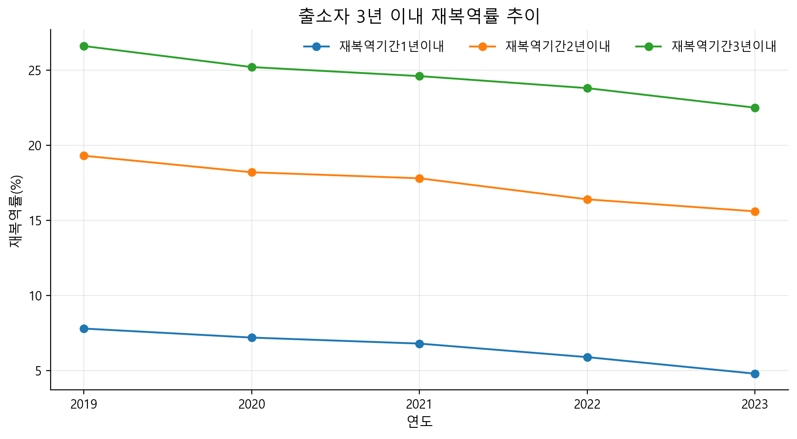
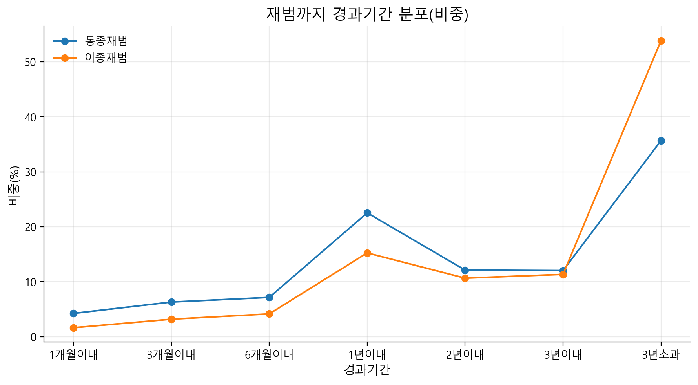
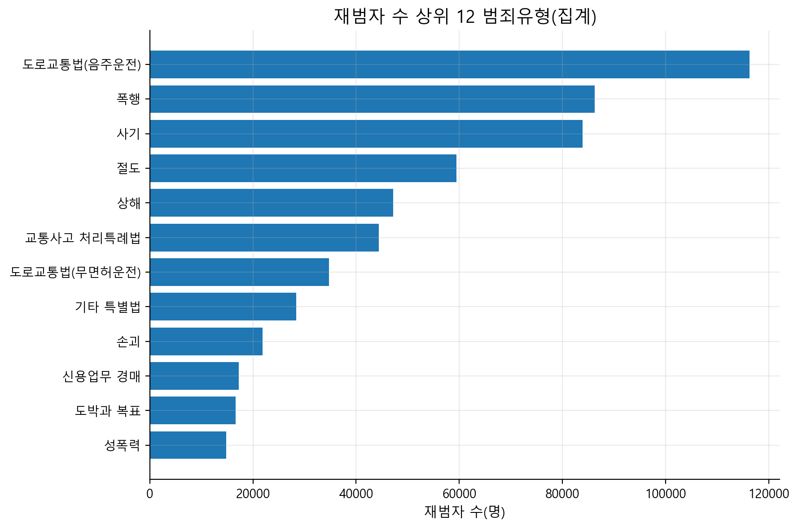
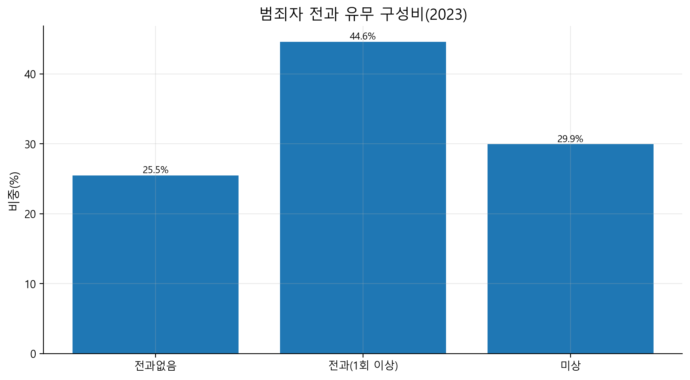
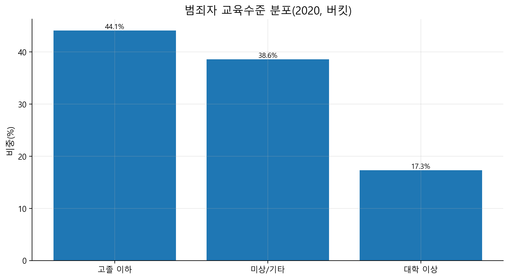
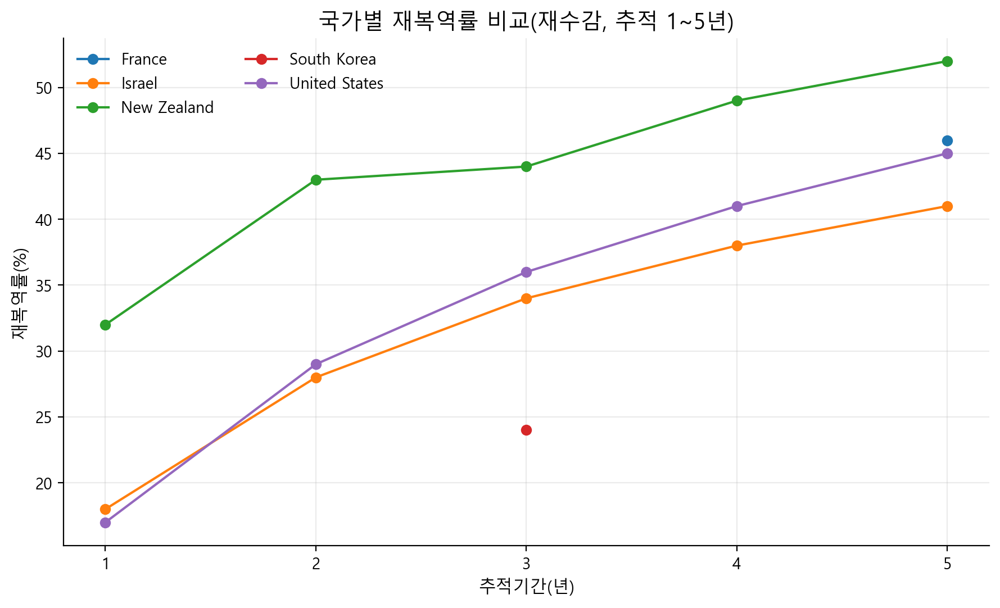

# Criminal Analysis (Starter)

공공데이터 CSV/엑셀을 전처리하고, 가설(H1~H4)에 필요한 요약 테이블과 시각화 이미지를 생성하는 미니 프로젝트입니다.

## 가설(H1~H4)
- **H1**: 2023년 전과 유무(전과없음 vs 전과) 구성비
- **H2**: 재범까지 경과기간 분포(동종/이종)
- **H3**: 교육수준(고졸이하 vs 대학이상) 분포
- **H4**: 국가별 재복역률 비교(추적기간 1~5년, 가능한 국가만)

## 산출물
- 요약 테이블: `outputs/*.csv` (H1~H4)
- 시각화 이미지: `outputs/figures/*.png`

### 01. 국내 3년 이내 재복역률 추이

### 02. 재범까지 경과기간 분포(비중)

### 03. 재범자 수 상위 범죄유형

### 04. 전과 유무 구성비(2023)

### 05. 교육수준 분포(2020, 버킷)

### 06. 국가별 재복역률 비교(추적 1~5년)

## 데이터 흐름
- `data/raw` (원본) → `src/preprocess.py` → `data/processed` (tidy)
- `data/processed` → `src/make_tables.py` → `outputs` (H1~H4 테이블)
- `data/processed` → `src/visualize.py` → `outputs/figures` (이미지)